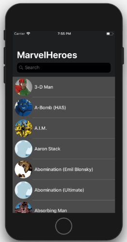
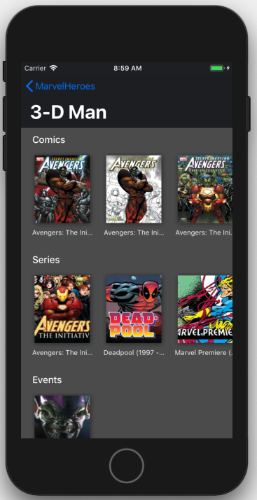
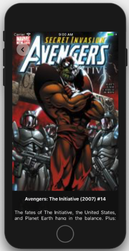

 Marvel Heroes
======================================

[](https://app.bitrise.io/app/de4e7fe1c0348503)
[](https://codecov.io/gh/narlei/marvelheroes)

[](https://twitter.com/narleimoreira)


This app lists all Marvel heros and his Comics, Series and more.

|   |   |   |
|---|---|---|
||||

## Features
- List all Marvel characters
- Search
- List Comics, Events, Series and Stories from Characters
- See details about Comics, Events, Series and Stories from Characters
- Peek & Pop

## Instalation


### Cocoapods
You need [Cocoapods](https://cocoapods.org) in your computer. 

Clone the project and Run:

`pod install`

### API Keys
Generate your API Keys in the [Marvel Portal](https://developer.marvel.com).

Set your keys in `Constants.swift` file:
`MarvelHeroes/Enums/Constants.swift`

````swift
enum Constants {
    enum API {
        static let baseAddress = "https://gateway.marvel.com/v1/public"
        static let privateKey = "YOUR_KEY"
        static let publicKey = "YOUR_KEY"
    }
...
````

## Design

See the prototype [here](https://bit.ly/2Ccogvl). You can run the protorype [here](https://bit.ly/2CofCdj).

Sketch project is inside `design` folder.


## Libraries

- [SDWebImage](https://github.com/rs/SDWebImage)
- [Moya](https://github.com/Moya/Moya)
- [UIScrollView-InfiniteScroll](https://github.com/pronebird/UIScrollView-InfiniteScroll)
- [R.swift](https://github.com/mac-cain13/R.swift)
- [ObjectMapper](https://github.com/Hearst-DD/ObjectMapper)
- [ANLoader](https://github.com/ANSCoder/ANLoader)

## Git
This app uses git-flow, please install `git-flow-avh` in your computer.


## Build

This app uses [Bitrise.io](https://www.bitrise.io/) to Test and Deploy.

There are 2 workflows:


**Primary**

If: `push` to `develop` branch or `PR`
Then: Run tests and update codecov

**Deploy**

If: `push` to `master`
Then: Run tests, update codecov and deploy to AppStore.

**ToDo**

To deploy locally, run with `fastlane`. 
**How?**
To integrate, [install](https://docs.fastlane.tools) [Fastlane Tools](https://fastlane.tools), after this, in the project folder run `fastlane init`, setup your Apple account and done, just run `fastlane` command and select the lane.

## Internacionalization

This project uses [lokalise.co](https://lokalise.co) Software to manage localizable files.

**What?**

1. Upload localization files
We support all popular iOS, Android and web localization file formats.

2. Translate
Invite your team to work on translations, or use professional translation services provided by our partners.

3. Integrate
Use Lokalise iOS and Android SDK, API, CLI tool and other integration options, or simply download the files.

### Library [R.swift](https://github.com/mac-cain13/R.swift)

Easy to use plurals and all internationalization attributes.

*How it works?*


````swift
print(R.string.localizable.yesterday()) // Ontem
````


````swift
print(R.string.localizable.days_ago(format: date.daysAgo)) // 5 dias atrás
````

````swift
print(R.string.localizable.like_activity_title(format: activityPost.arrayLikes.count)) // Curtida / Curtidas
````


